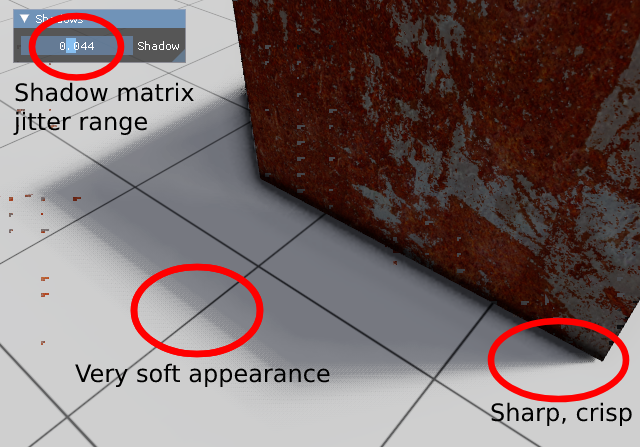
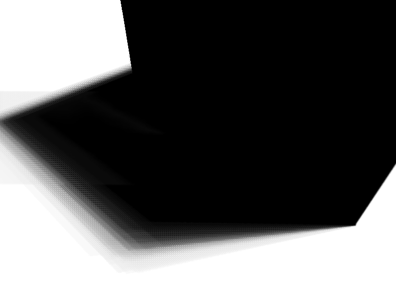

# Parkbox2

Real-time plant growth simulation paired with a Vulkan rendering engine specialized for dense foliage.

PBX2 leverages several modern GPU features and techniques to achieve high performance:
- Instanced rendering
- Indirect GPU-driven rendering
- Multi-draw
- Bindless rendering

All these rendering techniques reduce overhead for:
- PBR rendering (with IBL)
- Ground-truth AO
- Temporal soft shadows (no PCF, PCSS, or VSMs, etc).

## Graphics

The PBR rendering is primarily based on Filament.

Ground-truth AO is implemented based on the original paper.

Temporal soft shadows are a niche shadow filtering technique. I only know of one other renderer which does this; Blender Eevee.
They are still a quite performant solution to shadow filtering as they give you PCSS-like contact hardening whilst only requring a single sample from the shadow map.
The temporal accumulation currently only reprojects UV and rejects based on depth. Motion vectors are not used (yet).

## Temporal shadows

Traditional techniques for shadow rendering involve PCF filtering to soften edges of shadows uniformly, or the more expensive PCSS filtering in order to achieve a "soft-shadows" look where shadows harden at contact and are softened more further away from the shadow caster. However, a much simpler approach which can be integrated with existing shadow map implementations with relative ease is temporal reprojecton of the shadows in screen space, with each frame jittering the shadow view matrix by a small random amount (the range of the random distribution gives softer/harder shadows). This shadow map in screen space can be averaged with the previous N frames to give the softness effect.

Starting with the shadow map (in this case a cascaded shadow map):

This can be sampled as normal, however, taking the previous N frames average (take this as a rolling average, as in it is stored in a single texture):

Adding the shadow samples **with a given coefficient**:

Gives the final screen-space shadow map. This is ready to use in subsequent passes as it can simply be sampled with fragment coordinates.

The primary coefficient in this implementation is 0.05, however a secondary coefficient is used for dithering by a Bayer matrix, which improves the quality of the temporal accumulation at a very low cost. The accumulated shadow texture is considered an exponential moving average of the shadow samples:

$$
s_n = (1 - \alpha) s_{n-1} + \alpha x
$$

The bulk of this implementation can be seen in res/shaders/shadow_accum.fs.

An alternative is to perform the temporal reprojection in shadow space - however, "regular" shadow maps won't work well for this. Instead, this would require the use of variance shadow maps or moment shadow maps, which can be convoluted in shadow map space. Effective application of this would reduce the motion artifacts present in this project's implementation.
